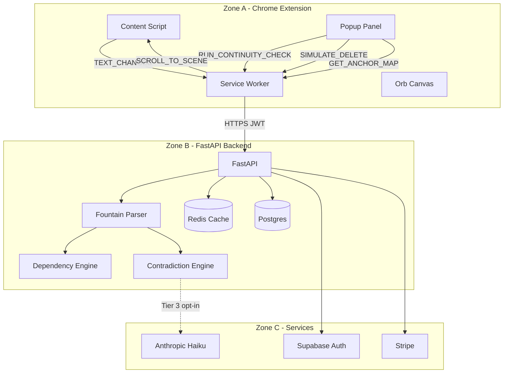

# ScriptLens — Product Architecture Documentation

| Field | Value |
|-------|-------|
| **Version** | 2.4 (consolidated) |
| **Date** | May 2026 |
| **Status** | Architecture specification + current implementation map |
| **Audience** | Engineering, product, screenwriter-facing design |
| **Source** | ScriptLens Architecture v2.3 + `scriptlensCore` codebase + v2.4 workflow refinements |

---

## Table of contents

1. [Executive summary](#1-executive-summary)
2. [Product definition](#2-product-definition)
3. [System overview — three zones](#3-system-overview--three-zones)
4. [User workflows](#4-user-workflows)
5. [Chrome extension architecture (Zone A)](#5-chrome-extension-architecture-zone-a)
6. [Backend architecture (Zone B)](#6-backend-architecture-zone-b)
7. [Third-party services (Zone C)](#7-third-party-services-zone-c)
8. [Core engine: scene dependency](#8-core-engine-scene-dependency)
9. [Core engine: plot contradiction](#9-core-engine-plot-contradiction)
10. [Data models and API contracts](#10-data-models-and-api-contracts)
11. [Analysis pipelines](#11-analysis-pipelines)
12. [UI architecture — popup panel](#12-ui-architecture--popup-panel)
13. [Scroll-to-scene navigation](#13-scroll-to-scene-navigation)
14. [Security and privacy](#14-security-and-privacy)
15. [Performance and reliability](#15-performance-and-reliability)
16. [Infrastructure and deployment](#16-infrastructure-and-deployment)
17. [Implementation status](#17-implementation-status)
18. [Build sequence](#18-build-sequence)
19. [Out of scope](#19-out-of-scope)
20. [Appendix A — System diagram](#appendix-a--system-diagram)
21. [Appendix B — Glossary](#appendix-b--glossary)

---

## 1. Executive summary

ScriptLens is an **AI-powered screenplay intelligence layer** delivered as a **Chrome extension**. It helps screenwriters understand:

- **Scene dependency** — how scenes connect, and what breaks if a scene is cut or changed
- **Plot contradiction** — continuity conflicts across the script (timeline, character status, object possession, and related facts)

The product floats above any web-based screenplay editor (WriterDuet, Arc Studio, Google Docs) as a small **interactive orb**. Analysis runs on a **FastAPI backend** with **spaCy** and **NetworkX**. Target machines: **8GB+ RAM**, active footprint **~24.5MB** with popup open.

### v2.4 product direction (refined workflow)

| Feature | When it runs | Why |
|---------|--------------|-----|
| **Scene dependency + simulate** | During draft (on demand) | Writers cut and reorder constantly; simulation is fast and actionable |
| **Plot contradiction report** | End of draft / explicit “Run continuity check” | Drafts are intentionally messy; live contradiction checks create false positives |

---

## 2. Product definition

### 2.1 Target user

Working screenwriters revising feature scripts, pilots, and short films in browser-based editors.

### 2.2 Core value proposition

| Problem | ScriptLens answer |
|---------|-------------------|
| “If I cut this scene, what breaks?” | Dependency graph + **Simulate delete/change** |
| “Did I contradict myself?” | **Continuity report** with scroll-to-scene |
| “Where is that scene?” | **Go to scene** navigation from any result |

### 2.3 What ScriptLens is not

- Not a screenplay editor
- Not a literary critic (theme, pacing, dialogue quality)
- Not a replacement for human story notes
- Not a live grammar or spell checker

### 2.4 Platform

- **Primary:** Chrome extension (Manifest V3)
- **Secondary:** CLI / API for testing and batch analysis (current `scriptlensCore` repo)

---

## 3. System overview — three zones

```
┌─────────────────────────────────────────────────────────────────┐
│  ZONE A — Chrome Extension (capture + render, no analysis)      │
│  Content script │ Service worker │ Orb │ Popup panel            │
└────────────────────────────┬────────────────────────────────────┘
                             │ HTTPS (JWT)
┌────────────────────────────▼────────────────────────────────────┐
│  ZONE B — FastAPI Backend (all intelligence)                    │
│  Parse │ spaCy NLP │ NetworkX graph │ Contradiction engine      │
│  Redis cache │ Postgres history │ Auth middleware               │
└────────────────────────────┬────────────────────────────────────┘
                             │
┌────────────────────────────▼────────────────────────────────────┐
│  ZONE C — Third-party services                                │
│  Supabase Auth │ Upstash Redis │ Anthropic Haiku │ Fly.io │ Stripe│
└─────────────────────────────────────────────────────────────────┘
```

### Zone responsibilities

| Zone | Owns | Must not own |
|------|------|--------------|
| **A — Extension** | Text extraction, UI, orb state, scroll, scratchpad | NLP, graph logic, contradiction rules |
| **B — Backend** | Parsing pipeline, engines, caching, persistence | DOM access, editor scroll |
| **C — Services** | Auth, cache, LLM, billing, hosting | Business logic |

**Principle:** The popup knows scene IDs and Y-offsets; the content script owns scroll. These responsibilities never swap.

---

## 4. User workflows

### 4.1 Draft mode (while writing)

1. Writer edits script in host editor.
2. Extension captures text and hash (debounced).
3. Writer opens popup → **Dependencies** tab.
4. Parser builds scene list and dependency graph.
5. Writer highlights a scene → **Simulate delete** (or simulate edit, future).
6. Panel shows downstream impacted scenes.
7. Writer clicks **Go to scene** to jump in the editor.

**No full contradiction report** during draft.

### 4.2 Continuity review mode (draft complete)

1. Writer clicks **Run continuity check**.
2. Full script sent to backend (or local engine in dev).
3. Fact extraction + Tier 1 + Tier 2 (+ optional Tier 3).
4. **Contradictions** tab lists issues with excerpts.
5. Writer uses **Go to scene A / B**, fixes issues, re-runs when ready.

**Trigger:** Explicit user action — not automatic on every keystroke.

### 4.3 Orb state machine

| State | Colour | Meaning | Entry | Exit |
|-------|--------|---------|-------|------|
| **WATCHING** | Teal fade | Idle, monitoring edits | Load / popup closed | Edit threshold or 4min idle |
| **ANALYSING** | Purple | Request in flight | User runs analysis | Response or 8s timeout |
| **RESULTS_READY** | Amber pulse | Report available | Backend responds | User opens popup |
| **DORMANT** | Gray 40% | No activity | 240s no edit | Any keystroke |
| **COOLING** | Red dim | Rate limit | 3 opens in 90s | 60s timer |

In draft mode, the orb may stay WATCHING longer; ANALYSING / RESULTS_READY apply when dependency refresh or continuity check completes.

---

## 5. Chrome extension architecture (Zone A)

### 5.1 Module breakdown

| Module | File (planned) | Responsibility |
|--------|----------------|----------------|
| **Content script** | `content.ts` | DOM text extraction, MutationObserver, orb canvas, anchor map, scroll |
| **Service worker** | `background.ts` | State machine, Fountain.js parse, API client, message routing |
| **Popup** | `popup/` React app | Scratchpad, Dependencies tab, Contradictions tab |
| **Orb** | Canvas 52px | Visual FSM states + HSL colour-fade |

### 5.2 Content script — key functions

| Function | Signature | Purpose |
|----------|-----------|---------|
| `extractText()` | `() => string` | Read screenplay text from host editor DOM |
| `buildSceneAnchorMap()` | `() => Record<string, number>` | Map `scene_001` → Y-offset for scroll |
| `scrollToScene()` | `(yOffset: number) => void` | `window.scrollTo({ top: yOffset - 80, behavior: 'smooth' })` |

**Scene heading detection:** Text nodes matching `/^(INT\.|EXT\.)/i` — editor-agnostic (WriterDuet, Arc, Google Docs).

### 5.3 Service worker — message types

| Message | Direction | Handler |
|---------|-----------|---------|
| `TEXT_CHANGED` | content → SW | Hash, debounce, optional dependency refresh |
| `RUN_CONTINUITY_CHECK` | popup → SW → API | Full contradiction pipeline |
| `SIMULATE_SCENE_DELETE` | popup → SW → API | Delete-impact for one scene |
| `GET_ANCHOR_MAP` | popup → SW → content | Returns anchor map |
| `SCROLL_TO_SCENE` | popup → SW → content | Forwards `{ sceneId, yOffset }` |

### 5.4 Text capture

- **MutationObserver** on editor container
- **1.5s debounce** after last change
- **Hash** screenplay text (SHA-256 or similar)
- Post to SW only when hash changes
- Paste = 1 edit; undo does not decrement edit counter

### 5.5 Fountain.js parsing (extension)

- Runs in service worker
- Produces `SceneBlock[]` with sequential IDs: `scene_001`, `scene_002`, …
- **Must match** anchor map numbering from content script

---

## 6. Backend architecture (Zone B)

### 6.1 Stack

| Component | Technology |
|-----------|------------|
| API framework | FastAPI (Python 3.11+) |
| NLP | spaCy `en_core_web_sm` |
| Graph | NetworkX `DiGraph` |
| Cache | Upstash Redis (24h TTL, keyed by script hash) |
| Database | Postgres (Supabase) |
| Hosting | Fly.io |
| LLM (Tier 3) | Anthropic Claude Haiku 3.5 |

### 6.2 API endpoints

| Endpoint | Method | Purpose | v2.4 usage |
|----------|--------|---------|------------|
| `/health` | GET | Liveness probe | Ops |
| `/analyse` | POST | Full analysis (deps + contradictions) | Continuity check |
| `/analyse/dependencies` | POST | Parse + graph only | Draft mode / simulate |
| `/scene/delete-impact` | POST | Downstream impact for one scene | Simulate delete |
| `/scene/simulate-edit` | POST | Re-parse modified scene + edge delta | Simulate change (future) |
| `/script/history` | GET | Past analysis runs for user | History view |

v2.3 defined `/analyse`, `/scene/delete-impact`, `/script/history`. v2.4 adds dependency-only and simulate endpoints for efficiency.

### 6.3 Request / response flow

```
POST /analyse
  Body: { script_id?, screenplay_text, include_tier3?: bool }
  → Redis lookup by hash(screenplay_text)
  → Cache miss:
      1. parse_fountain_text()
      2. build_graph()
      3. extract_facts() + run_tier1() + run_tier2() [+ tier3 if enabled]
      4. assemble AnalysisResult
      5. cache + persist run metadata
  → Response: AnalysisResult JSON
```

### 6.4 Backend modules (Python — current repo)

| Module | File | Responsibility |
|--------|------|----------------|
| Parser + dependency | `scene_dependency.py` | Fountain parse, graph, queries |
| Contradiction | `plot_contradiction.py` | Fact store, Tier 1/2 rules |
| Orchestrator | `scriptlens_analyser.py` | Combined pipeline + report shape |
| PDF loader | `pdf_screenplay_loader.py` | PDF → Fountain text |
| CLI | `run_scriptlens.py` | Local analysis entry point |

---

## 7. Third-party services (Zone C)

| Service | Role |
|---------|------|
| **Supabase** | User auth (JWT), optional Postgres |
| **Upstash Redis** | Analysis result cache by script hash |
| **Anthropic API** | Tier 3 contradiction (Haiku), batched |
| **Fly.io** | Backend hosting |
| **Stripe** | Subscriptions, feature gating |
| **Vercel** | Optional marketing/docs site |

### Billing tiers (planned)

| Tier | Dependency simulate | Continuity check | Tier 3 LLM | History |
|------|---------------------|------------------|------------|---------|
| Free | Limited/day | Limited/month | No | No |
| Pro | Unlimited | Unlimited | Opt-in | Yes |

---

## 8. Core engine: scene dependency

### 8.1 Purpose

Answer: **“Which later scenes rely on something established in an earlier scene?”**

### 8.2 Input — SceneBlock

```
scene_id: str          # "scene_001"
scene_number: int      # 1
heading: str           # "INT. MOTEL ROOM - DAY"
characters: list[str]
objects: list[str]     # spaCy noun chunks from action lines
locations: list[str]   # from heading
raw_text: str
```

### 8.3 Dependency signals

| Signal | Weight (spec) | Weight (implemented) | Detection |
|--------|---------------|----------------------|-----------|
| Character reappearance | 1.0 | **1.0** | Named character cue repeats |
| Object reference | 0.7 | **0.7** | Noun phrase reappears |
| Established fact | 0.6 | Planned | Fact store reuse |
| Causal dialogue | 0.5 | Planned | “After what you did”, temporal refs |
| Location continuity | 0.4 | **0.4** | Location from heading repeats |

### 8.4 Graph model

- **Type:** Directed graph (scene order enforced)
- **Node:** One per scene
- **Edge:** `from_scene_id` (earlier) → `to_scene_id` (later)
- **Merged edges:** Multiple signals between same pair → weights summed

**DependencyEdge:**

```
from_scene_id, to_scene_id, weight, edge_type, explanation
```

### 8.5 Query operations

| Operation | Method | Writer-facing output |
|-----------|--------|----------------------|
| Upstream deps | `get_scene_dependencies(scene_id)` | “This scene depends on…” |
| Delete impact | `get_delete_impact(scene_id)` | “Cutting this affects…” |
| Orphans | `get_orphan_scenes()` | Scenes nothing later references |
| Summary | `export_graph_summary()` | Totals, most-depended-on, avg deps |
| High-risk rank | Derived from delete-impact count | “Scenes you should not cut lightly” |

### 8.6 Simulate delete (v2.4)

```
Input:  current graph + scene_id to remove
Process:
  1. Identify nx.descendants(graph, scene_id)
  2. For each descendant: shortest path + total path weight
  3. Return sorted impact list
Output: SimulateDeleteResult { removed_scene, impacted_scenes[], paths[] }
```

**Important:** Simulation is read-only — it does not modify the writer’s script.

### 8.7 Simulate edit (future)

```
Input:  scene_id + modified scene text
Process:
  1. Re-parse single scene
  2. Recompute edges touching that scene
  3. Return edge diff (added/removed/changed)
```

---

## 9. Core engine: plot contradiction

### 9.1 Purpose

Answer: **“Do two parts of the script assert incompatible facts?”**

Runs **on demand** at continuity review — not on every keystroke.

### 9.2 Fact extraction

| Fact type | Examples |
|-----------|----------|
| `character_status` | “VANCE is dead” |
| `timeline` | “Today is Monday”, “Yesterday was Wednesday” |
| `character_trait` | “Marcus is a surgeon” |
| `object_ownership` | “Elena picks up the silver key”, “Marcus has the ledger” |
| `location` | Heading location + “warehouse was abandoned…” |

### 9.3 Three-tier detection

| Tier | Technology | Confidence | Cost | When used |
|------|------------|------------|------|-----------|
| **Tier 1** | Python rule engine | ~0.95 | Zero | Continuity check |
| **Tier 2** | spaCy semantic similarity | ~0.55–0.75 | Zero | Continuity check |
| **Tier 3** | Claude Haiku 3.5 | ~0.60 | ~$0.03/call | Opt-in, ambiguous only |

### 9.4 Tier 1 contradiction types (implemented)

| Type | Rule |
|------|------|
| `character_alive_status` | Character established dead → later appears/speaks |
| `timeline_consistency` | Conflicting day-of-week / timeline anchors (flashback markers suppressed) |
| `character_trait_conflict` | Same character, incompatible roles/professions |
| `object_ownership` | Object possessed by A → later “has” by B without transfer |

### 9.5 Tier 2 (implemented)

- Same entity + same fact type across two scenes
- spaCy similarity below threshold (`TIER2_SIMILARITY_THRESHOLD = 0.35`)
- Opposing state terms force low similarity (e.g. abandoned vs active)
- Output type: `semantic_<fact_type>` (e.g. `semantic_location`)
- Skips pairs already covered by Tier 1

### 9.6 Tier 3 (planned)

- Batch ambiguous Tier 2 candidates
- Send up to 500 chars excerpt to Haiku
- 90s batching window
- User opt-out in settings
- Target: FP rate below 10% on labeled corpus

### 9.7 Contradiction output fields

```
contradiction_id, scene_id_a, scene_id_b, scene_number_a, scene_number_b
contradiction_type, explanation, confidence, tier, fact_a, excerpt_b
```

---

## 10. Data models and API contracts

### 10.1 TypeScript types (extension)

| Type | Fields |
|------|--------|
| `SceneBlock` | `id, heading, type, characters[], action[], dialogue[], objects[], hash` |
| `DependencyEdge` | `fromSceneId, toSceneId, weight, edgeType, explanation` |
| `Contradiction` | `id, sceneId, excerpt, conflictsWith, conflictSceneId, confidence, tier, type, explanation` |
| `AnalysisResult` | `scriptId, timestamp, scenes, dependencies, contradictions, healthScore` |
| `SceneAnchorMap` | `Record<string, number>` |
| `SimulateDeleteResult` | `removedSceneId, impactedScenes[], paths[]` |
| `FadeState` | `editCount, editVelocity, fadeIntensity, lastEditAt` |

### 10.2 AnalysisResult shape (API)

```json
{
  "scriptId": "uuid",
  "timestamp": "ISO-8601",
  "scenes": [],
  "dependencies": {
    "edges": [],
    "graphSummary": {
      "totalScenes": 22,
      "totalEdges": 27,
      "mostDependedOnScene": "scene_001",
      "orphanCount": 4,
      "avgDependenciesPerScene": 1.41
    },
    "highRiskScenes": [
      {
        "sceneId": "scene_001",
        "heading": "INT. FEDERAL ARCHIVES - DAY",
        "wouldBreak": 14,
        "impactedScenes": ["scene_009"]
      }
    ]
  },
  "contradictions": {
    "totalFound": 3,
    "byTier": { "tier1": 2, "tier2": 1, "tier3": 0 },
    "items": []
  },
  "healthScore": 64
}
```

### 10.3 Postgres schema (planned)

| Table | Key columns |
|-------|-------------|
| `users` | `id, email, stripe_customer_id, tier` |
| `scripts` | `id, user_id, title, hash, created_at` |
| `analysis_runs` | `id, script_id, hash, result_json, duration_ms, tier_counts, created_at` |

---

## 11. Analysis pipelines

### 11.1 Pipeline A — Dependency refresh (draft mode)

```
screenplay_text
  → parse_fountain_text()
  → build_graph()
  → export summaries + per-scene deps
  → cache by hash (optional, short TTL)
```

**SLA target:** < 400ms p95 for 120 scenes (no contradiction).

### 11.2 Pipeline B — Simulate delete

```
graph (already built) + scene_id
  → get_delete_impact(scene_id)
  → return impact list
```

**SLA target:** < 50ms p95.

### 11.3 Pipeline C — Continuity check (full)

```
screenplay_text
  → parse_fountain_text()
  → extract_facts()
  → run_tier1()
  → run_tier2(tier1_results)
  → [optional] run_tier3(ambiguous)
  → deduplicate + sort by confidence
  → AnalysisResult
```

**SLA target:** < 800ms p95 cache miss without Tier 3.

### 11.4 Caching strategy

| Key | TTL | Invalidation |
|-----|-----|--------------|
| `analysis:{hash}` | 24h | Script text hash change |
| `deps:{hash}` | 1h | Script text hash change |

---

## 12. UI architecture — popup panel

### 12.1 Layout

```
┌──────────────────────────────────────────────────────────┐
│  ScriptLens                                    [× close] │
├─────────────────────┬────────────────────────────────────┤
│  SCRATCHPAD (340px) │  ANALYSIS (420px)                  │
│                     │  [Dependencies] [Contradictions]   │
│  Your notes —       │                                    │
│  cleared when close │  Tab content                       │
│  0 / 40 words       │                                    │
└─────────────────────┴────────────────────────────────────┘
```

**Popup width:** 760px total.

### 12.2 Scratchpad

- Max **40 words** (~200 characters)
- Live counter: `0 / 40 words`
- Amber at 35+ words, red at 40
- **Ephemeral** — destroyed on popup close
- Never sent to server

### 12.3 Dependencies tab (v2.4)

| Element | Behavior |
|---------|----------|
| Scene list | All scenes: number, heading, upstream dependency count |
| Scene selection | Highlight one scene |
| **Simulate delete** | Shows downstream impact panel |
| **Simulate edit** | (Future) Shows edge diff after content change |
| Impact list | Affected scenes with path + weight |
| **Go to scene** | ScrollButton per scene |
| Summary strip | Total edges, orphans, high-risk scenes |

### 12.4 Contradictions tab (v2.4)

| State | UI |
|-------|-----|
| **Not run** | Empty state + **Run continuity check** button |
| **Running** | Spinner + “Analysing your script…” |
| **Complete** | ContradictionCard list |

**ContradictionCard fields:**

- Plain-language label
- Scene A / Scene B numbers
- Excerpts from both scenes
- Confidence % + tier badge
- **Go to scene A** / **Go to scene B** buttons

### 12.5 React component tree

```
App
├── ScratchpadColumn
│   ├── ScratchpadTextarea
│   └── WordCounter
└── AnalysisColumn
    ├── TabBar [Dependencies | Contradictions]
    ├── DependencyTab
    │   ├── SceneListItem (×N)
    │   ├── SimulatePanel
    │   └── ImpactPopover
    └── ContradictionTab
        ├── ContinuityCheckPrompt (empty state)
        └── ContradictionCard (×N)
            └── ScrollButton (×2)
```

---

## 13. Scroll-to-scene navigation

### 13.1 Flow

1. Popup opens → `GET_ANCHOR_MAP`
2. Content script scans DOM for INT./EXT. headings
3. Returns `{ scene_001: 0, scene_002: 842, ... }`
4. User clicks “Go to scene 12”
5. `SCROLL_TO_SCENE { sceneId: "scene_012", yOffset }`
6. Service worker forwards to content script
7. `scrollToScene(yOffset - 80)`

### 13.2 Editor compatibility

| Editor | Strategy | Fallback |
|--------|----------|----------|
| WriterDuet | Text-node `/^(INT\|EXT)\./i` | Empty map → disabled button + tooltip |
| Arc Studio | Same | Same |
| Google Docs | `.kix-paragraphrenderer` spans | Same |
| Upload / no DOM | N/A | Hide scroll buttons |

### 13.3 Critical invariant

Scene numbering must match between Fountain.js parser (service worker) and anchor map builder (content script). Both use sequential order: `scene_001`, `scene_002`, …

---

## 14. Security and privacy

| Concern | Risk | Mitigation |
|---------|------|------------|
| Script text to server | Sensitive creative content | Disclosed in onboarding; HTTPS; retention limits |
| Haiku excerpts (Tier 3) | Third-party AI | Opt-out; max 500 chars; privacy policy |
| Scratchpad | Private notes | Never leaves browser; destroyed on close |
| Anchor map DOM read | Host page access | Read-only; memory only; destroyed on close |
| SCROLL_TO_SCENE | Modifies scroll | Disclosed in Chrome Web Store permissions |
| JWT tokens | Auth | `chrome.storage.local`; 1hr expiry |

**Production logging:** Never log full screenplay body. Log `script_hash`, `scene_count`, `duration_ms`, `request_id` only.

---

## 15. Performance and reliability

### 15.1 Latency budget

| Step | p50 | p95 |
|------|-----|-----|
| `buildSceneAnchorMap` | < 15ms | < 40ms |
| `GET_ANCHOR_MAP` round-trip | < 25ms | < 60ms |
| `SCROLL_TO_SCENE` round-trip | < 10ms | < 30ms |
| Fountain parse (120 scenes) | < 100ms | < 200ms |
| Dependency graph build | < 200ms | < 400ms |
| Full continuity (no Tier 3) | < 400ms | < 800ms |
| Redis cache hit | < 20ms | < 100ms |

### 15.2 RAM profile (popup open)

| Component | RAM |
|-----------|-----|
| Extension base | ~24 MB |
| SceneAnchorMap (120 scenes) | ~0.5 MB |
| Word counter | < 0.1 MB |
| **Total** | **~24.5 MB** |

### 15.3 Failure modes

| Failure | Degradation | Recovery |
|---------|-------------|----------|
| Anchor map empty | Scroll buttons disabled + tooltip | Retry after 200ms; re-request on popup open |
| Backend timeout (8s) | Orb returns to WATCHING; error toast | User retries |
| Tab closed during scroll | Silent catch | N/A |
| Redis down | Uncached analysis (slower) | Auto when Redis recovers |
| Parser returns 0 scenes | Empty state + format hint | User checks Fountain formatting |

---

## 16. Infrastructure and deployment

### 16.1 Environments

| Environment | Extension | Backend | Purpose |
|-------------|-----------|---------|---------|
| **Local** | Unpacked dev | `uvicorn` + venv | Development |
| **Staging** | Chrome dev channel | Fly.io staging | QA + beta |
| **Production** | Chrome Web Store | Fly.io prod | Live users |

### 16.2 CI/CD (planned)

```
PR → pytest (engines) → lint → merge → deploy staging → promote production
Extension → build Plasmo → upload to Chrome Web Store
```

### 16.3 Monitoring (production)

| Metric | Alert threshold |
|--------|-----------------|
| `/analyse` p95 latency | > 2s for 5 min |
| Error rate | > 2% for 5 min |
| Redis unavailable | Immediate |
| User-dismissed contradictions (FP proxy) | > 15% rolling 7d |

---

## 17. Implementation status

### 17.1 Implemented (`scriptlensCore` repo)

| Component | Status |
|-----------|--------|
| Fountain parser (Python) | Done |
| Scene dependency engine | Done |
| Plot contradiction Tier 1 + Tier 2 | Done |
| Combined analyser + CLI | Done |
| PDF ingestion | Done |
| Screenwriter text report | Done |
| Regression test runners | Done (manual scripts) |
| Delete-impact query | Done |
| Orphan detection | Done |
| High-risk scene ranking | Done |

### 17.2 Not yet implemented

| Component | Status |
|-----------|--------|
| Chrome extension (orb, popup, scroll) | Not started |
| FastAPI service + endpoints | Not started |
| Redis cache | Not started |
| Postgres history | Not started |
| Supabase auth + Stripe | Not started |
| Tier 3 Haiku | Not started |
| Simulate edit endpoint | Not started |
| Established fact + causal dependency edges | Not started |
| pytest CI suite | Not started |
| v2.4 split pipelines (deps-only vs continuity) | Not started |

### 17.3 Repo file map

```
scriptlensCore/
├── scene_dependency.py
├── plot_contradiction.py
├── scriptlens_analyser.py
├── pdf_screenplay_loader.py
├── run_scriptlens.py
├── run_dependency_test.py
├── run_contradiction_test.py
├── real_screenplay_test.py
├── test_screenplay.py
├── test_contradiction_screenplay.py
├── docs/
│   └── ARCHITECTURE.md          ← this document
└── samples/
    └── _architecture_extracted.txt
```

---

## 18. Build sequence

| Phase | Duration | Deliverable | v2.4 notes |
|-------|----------|-------------|------------|
| **0** | Week 1 | FastAPI `/health`, Supabase, Fly.io, Stripe scaffold | Foundation |
| **1** | Weeks 1–2 | Fountain parser validated on 10 real scripts | Python parser exists |
| **2** | Week 2 | Orb FSM + canvas (5 states) | Extension |
| **2a** | Week 2 | Orb colour-fade (OrbFadeEngine) | Extension |
| **3** | Weeks 3–4 | Dependency backend + simulate endpoints | Engine mostly done |
| **4** | Week 4 | Dependency tab + simulate UI + scroll-to-scene | v2.4 simulate-first UX |
| **4a** | Weeks 5–7 | Contradiction T1+T2 + on-demand continuity tab | Engine mostly done |
| **5** | Week 7 | Tier 3 Haiku + batching | Optional for launch |
| **6** | Week 8 | Auth + billing + feature gating | |
| **7** | Week 9 | Health card (separate module) | Out of core doc |
| **8** | Weeks 10–11 | Polish, onboarding, Chrome Web Store | |

**Completion signals:**

- Phase 3: Delete scene 5 → correct impact on 3 scripts
- Phase 4: Writer simulates delete → sees impact → scrolls to scene
- Phase 4a: Continuity check FP rate < 10% on labeled corpus

---

## 19. Out of scope

| Module | Notes |
|--------|-------|
| **Gothic health card** | Separate module; canvas PNG export |
| **Screenplay editor** | ScriptLens overlays existing editors |
| **Dialogue quality / pacing AI** | Not in v2.4 scope |
| **Collaborative real-time editing** | Single-writer focus |

---

## Appendix A — System diagram



---

## Appendix B — Glossary

| Term | Meaning |
|------|---------|
| **Scene dependency** | A later scene relies on something introduced earlier (character, prop, location) |
| **Simulate delete** | Preview what later scenes lose setup if you cut a scene — does not edit your script |
| **Orphan scene** | No later scene references it; may be cuttable or need stronger ties |
| **Continuity check** | Full scan for plot contradictions across the finished draft |
| **Tier 1 contradiction** | Clear rule-based conflict (high confidence) |
| **Tier 2 contradiction** | Subtle wording mismatch (review recommended) |
| **Go to scene** | Scrolls your editor to that scene heading |

---

*End of document — ScriptLens Product Architecture v2.4*
