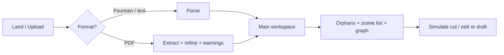

# ScriptLens — UX Specification v1.0

| Field | Value |
|-------|-------|
| **Status** | Implemented (customer v1) — see [§16 Implementation status](#16-implementation-status) |
| **Date** | 2026-07 |
| **Scope** | Upload-first web app (v1); extension overlay is v1.1 |
| **Audience** | Product, engineering, design review |

This document defines the **v1 structure workspace** UX. Visual mockups in [`docs/ux/`](ux/) remain the design reference; the live UI is in [`web/`](../web/).

**Scope lock:** Customer v1 is **structure-only** (orphans, simulate cut/edit, draft). The contradictions mockup (Screen C) is **not shipped** — contradiction detection stays internal/CI.

---

## 1. Product promise (one sentence)

**Upload your script, read it in large mode, see orphan scenes, simulate cutting or editing a scene to preview impact — without changing your original file.**

---

## 2. Visual mockups (key screens)

### Screen A — Main workspace (initial load)

After upload + parse. Simulate is **disabled** until a scene is selected.


| Zone | Purpose |
|------|---------|
| **Left (~280px)** | Orphan count, plot issue count, scene list, **Simulate cut** button |
| **Center (flex)** | Full script reader (Fountain-rendered) |
| **Right (~320px)** | Empty until simulation runs; placeholder copy |

---

### Screen B — Simulate cut active

User selected Scene 5 → clicked **Simulate cut**. Original file **unchanged**; preview only.


| Zone | Purpose |
|------|---------|
| **Left** | Selected scene highlighted; **Simulate cut** enabled (or shows **Clear simulation** after run) |
| **Center** | Removed scene shown as **ghost/strikethrough** with label *Simulated removal* |
| **Right** | Impact list, dependency paths, optional ~100-word summary, **Go to scene** links |

---

### Screen C — Contradictions + go to scene *(not in customer v1)*

**Deferred.** Mockup retained for a future continuity product surface. The v3 customer app does not call the contradiction engine.

---

## 3. Entry flow



### Upload screen (pre-workspace)

```
┌─────────────────────────────────────────────┐
│  ScriptLens                                  │
│                                              │
│     ┌─────────────────────────────────┐     │
│     │  Drop Fountain, PDF, or FDX      │     │
│     │  [ Choose file ]                 │     │
│     └─────────────────────────────────┘     │
│                                              │
│  Your script stays private. We never edit    │
│  your original file.                         │
└─────────────────────────────────────────────┘
```

**Supported v1:** `.fountain`, `.pdf`, `.txt`, `.md`  
**Not yet:** `.docx` (converter exists), `.fdx`  
**Copy if PDF:** *“Extracted from PDF — review scene breaks in the scene list.”* (shown in structure banner)

---

## 4. Layout specification

### Desktop (primary — min width 1024px)

| Column | Width | Contents |
|--------|-------|----------|
| Left panel | 280px fixed | Metrics, scene list, simulate CTA |
| Center | flex 1 | Script reader |
| Right panel | 320px fixed | Simulation results OR collapsed |

**Min viewport height:** script reader scrolls independently in center.

### Tablet / mobile (v1)

**Not implemented yet.** UX target: read-only script + scene list; simulate on desktop only (banner: *“Open on desktop for simulate and structural editing”*).

---

## 5. Left panel — detailed

```
┌─────────────────────────┐
│  ORPHANS            3   │  ← tap scrolls to first orphan
├─────────────────────────┤
│  [ Story graph ]        │  ← OSD timeline view
├─────────────────────────┤
│  SCENES                 │
│  1  INT. HOUSE - DAY    │
│  2  EXT. ROAD - NIGHT ⚠ │  ← orphan badge
│  5  EXT. SHIP - DAY  ◀  │  ← selected
├─────────────────────────┤
│  [ Simulate cut ]       │
│  [ Delete scene ]       │
│  [ Edit scene ]         │
│  [ Undo draft ]         │
│  [ Export draft ]       │
└─────────────────────────┘
```

*Plot issues card from early mockups is **not in customer v1**.*

### Orphans card

- **Number** = `get_orphan_scenes()` count
- Click → scrolls to first orphan (**filter list to orphans only: not yet**)

### Plot issues card

**Not in customer v1** (contradiction engine is internal only).

### Scene list row

| Field | Source |
|-------|--------|
| Scene number | Parser |
| Heading | Slugline (truncated 40 chars) |
| Badge | ⚠ orphan badge (`orphan` / `chain`) — **high-risk badge not yet in UI** |

**Selection:** single select only (v1).

### Simulate cut button

| State | Label | Action |
|-------|-------|--------|
| No selection | `Simulate cut` | disabled |
| Scene selected | `Simulate cut` | enabled → POST simulate |
| Simulation active | `Clear simulation` | resets preview |

**v1 does NOT require user to delete text.** One click simulates removal.

---

## 6. Center panel — script reader

- Render parsed scenes as **screenplay HTML** (monospace action, centered dialogue, bold sluglines)
- Each scene block: `id="scene-{number}"` for scroll targets
- **Selected scene:** teal left border
- **Simulated removal:** red ghost overlay + *Simulated removal* chip
- **Contradiction highlight:** yellow background fade 3s on *Go to scene*

**Non-destructive rule:** center panel never writes back to uploaded file.

---

## 7. Right panel — simulation results

Visible only after **Simulate cut** succeeds.

```
┌──────────────────────────────────────┐
│  Impact of removing Scene 5          │
│  ─────────────────────────────────── │
│  ⚠ Scene 12 — broken setup           │
│     Object: knife (path 5→9→12)      │
│     [ Go to scene 12 ]               │
│                                      │
│  ⚠ Scene 18 — downstream dependent   │
│     [ Go to scene 18 ]               │
│                                      │
│  ─── Summary (Pro / optional) ───    │
│  Removing the ship deck scene drops    │
│  the knife setup used in the escape…   │
│  (~100 words max)                    │
│                                      │
│  [ Clear simulation ]                │
└──────────────────────────────────────┘
```

### Data mapping (engine)

| UI row | API field |
|--------|-----------|
| Broken scenes | `impacted_scenes` from simulate cut |
| Path | `dependency_path` |
| Risk | `risk_level`, `summary`, `impact_reason` |
| Edit diff | `edge_diff`, `orphan_delta` on simulate edit |

---

## 8. Contradictions UX *(deferred — not customer v1)*

See Screen C note above. Internal evaluators use CLI reports and `run_corpus_batch.py`.

---

## 9. Orb (v1 web — simplified)

On upload workspace, orb is **top-left** or **minimized FAB**:

| State | Color | Meaning |
|-------|-------|---------|
| Idle | Teal | Script loaded |
| Analysing | Purple pulse | Parse / continuity running |
| Results | Amber | Issues or simulation ready |
| Error | Red dim | Retry offered |

Extension orb FSM (5 states) applies in **v1.1 Chrome build**.

---

## 10. Loading sequence (UX)

| Phase | User sees | Backend |
|-------|-----------|---------|
| T+0 | Upload progress | Receive file |
| T+1s | Script appears in center | Parse |
| T+1.5s | Scene list + **Orphans: N** + summary | Build OSD + continuity graphs |
| T+1.5s | **Simulate cut** enabled on select | Graph cached in session |

**Never block script view** waiting for contradictions.

---

## 11. Free vs Pro (future monetization)

Not implemented. Current build has no auth or tier gating. Planned differentiation may include AI impact summaries and unlimited continuity checks when a contradiction product returns.

---

## 12. Explicitly NOT in v1 UI (or not yet)

| Feature | Status |
|---------|--------|
| Contradiction list / go-to-scene | Deferred (internal engine only) |
| Multi-scene simulate | v2 |
| Live extension in Google Docs | v1.1 |
| Auto-save changes to original upload | Never |
| High-risk scene badges in scene list | Not yet (data in engine) |
| Mobile desktop-only banner | Not yet |
| `.docx` upload | Not yet |

---

## 13. Copy deck (consistent language)

| Context | Copy |
|---------|------|
| Simulate banner | *Preview only — working draft unchanged* |
| Simulate CTA | *Simulate cut* |
| Clear | *Clear simulation* |
| Draft delete confirm | Warns that draft orphans/simulate refresh |
| PDF hint | Structure banner ingest warnings |
| Empty right panel | *Select a scene, then click Simulate cut to see impact.* |

---

## 14. API map (implemented)

All routes are under `/api`. Session id = `script_id` from upload response.

| User action | Endpoint |
|-------------|----------|
| Upload | `POST /api/upload` |
| Script metadata | `GET /api/scripts/{script_id}` |
| Orphans | `GET /api/scripts/{script_id}/orphans` |
| Story graph | `GET /api/scripts/{script_id}/orphan-graph` |
| Scene body | `GET /api/scripts/{script_id}/scenes/{scene_id}` |
| Simulate cut | `POST /api/scripts/{script_id}/simulate/cut` |
| Simulate edit | `POST /api/scripts/{script_id}/simulate/edit` |
| Draft delete | `POST /api/scripts/{script_id}/draft/delete` |
| Apply edit to draft | `POST /api/scripts/{script_id}/draft/apply-edit` |
| Undo draft | `POST /api/scripts/{script_id}/draft/undo` |
| Export draft | `GET /api/scripts/{script_id}/draft/export` |
| Health | `GET /api/health` |

---

## 15. Acceptance checklist

Customer v1 structure workspace:

- [x] User can upload Fountain/PDF and read full script in center
- [x] Orphan count + summary visible after parse
- [x] Scene list selects one scene; simulate button enables
- [x] Simulate cut shows right panel impact without modifying upload
- [x] Clear simulation restores normal view
- [x] Simulate edit + draft delete/apply/undo/export
- [x] Story graph (orphan OSD view)
- [x] Banner *Preview only* during simulate / draft awareness
- [ ] High-risk badges on scene list
- [ ] Mobile/tablet desktop-only banner
- [ ] Contradiction go-to-scene (deferred — not v1)

---

## 16. Implementation status

| Area | Shipped | Gap |
|------|---------|-----|
| Upload + reader | Yes | `.docx` |
| Orphans + types + reasons | Yes | — |
| Story graph | Yes | — |
| Simulate cut + edit | Yes | — |
| Draft workflow | Yes | — |
| PDF ingest banner | Yes | — |
| Contradictions UI | No | By design |
| Auth / billing | No | v3.1 |

---

## 17. Related docs

- [`ARCHITECTURE_v3_STRUCTURE.md`](ARCHITECTURE_v3_STRUCTURE.md) — v3 architecture (authoritative)
- [`ARCHITECTURE.md`](ARCHITECTURE.md) — legacy v2.4 (contradiction + extension)
- [`SCRIPTLENS_STATUS_REPORT.md`](SCRIPTLENS_STATUS_REPORT.md) — current status
- [`CLIENT_PITCH_SIMULATE_FEATURES.md`](CLIENT_PITCH_SIMULATE_FEATURES.md) — demo talking points
- [`ux/`](ux/) — PNG mockups

---

*Last updated July 2026 — reflects shipped `web/` + `api/` workspace.*
